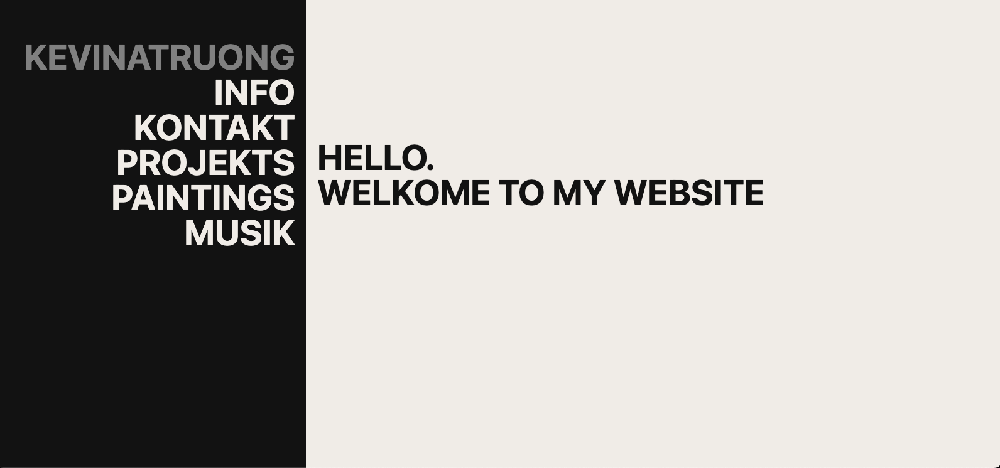

# kevinatruong.com astro portfolio
this is my portfolio site designed in figma and developed with astro

<p align="center">
  
  <br>
  <a href="https://kevinatruong.com/">Portfolio Wepage</a>
  <br>
</p>

## Project Structure

```text
astro-portfolio/
    ├── public
    │   ├── art                 # Folder containing art assets (images, drawings, etc.)
    │   ├── fonts               # Directory for font files used throughout the project
    │   ├── icon                # Directory for icon assets
    │   └── info                # Folder containing assets from info page
    └── src
        ├── components          # Directory for reusable components like Nav.astro
        ├── layouts             # Folder for layout component
        ├── pages               # Directory containing individual page components like index, art, info, and projects page
        └── scripts             # Folder for JavaScript or other scripts used in the project
```

## Installation

1. Clone the repository:
    `git clone https://github.com/your-username/astro-portfolio.git`
2. Install dependancies
    `npm install`
3. Starts local dev server
    `npm run dev`

### Usage

Feel free to use this as a template or reference!